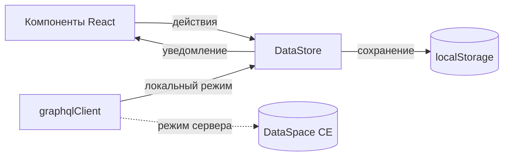
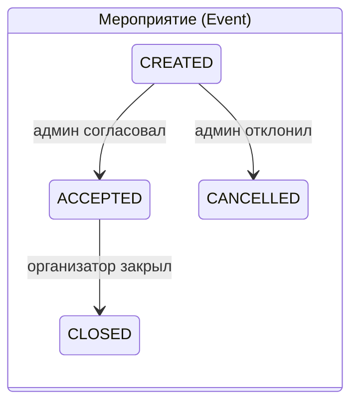
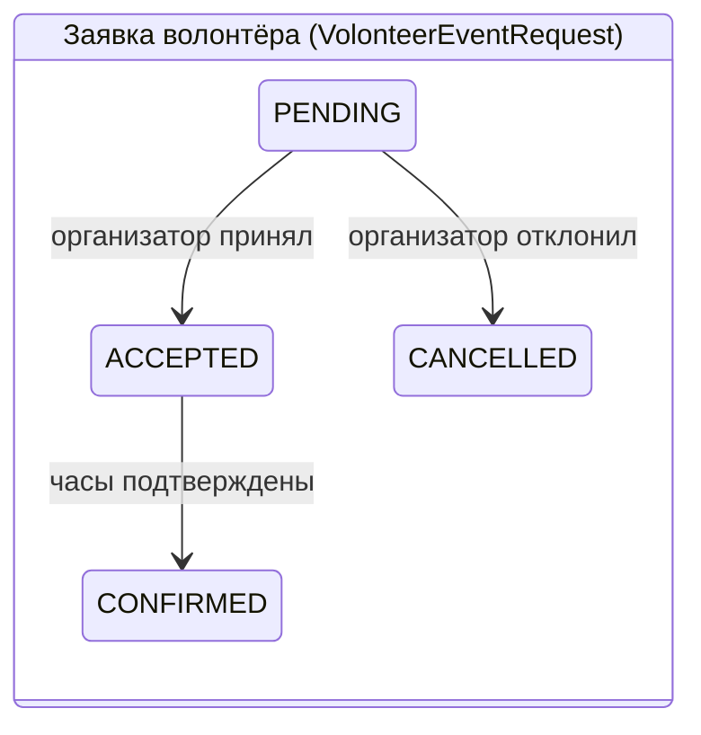
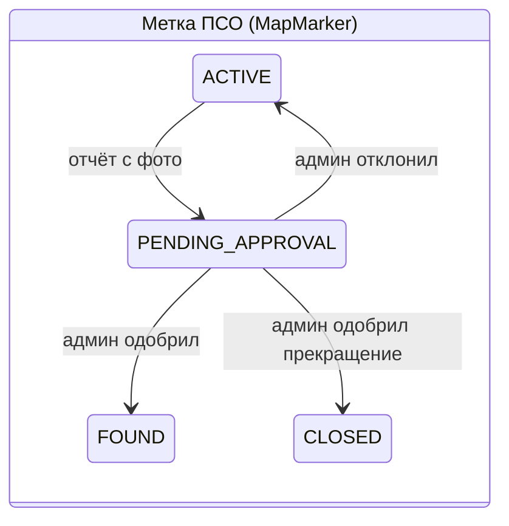

# Волонтёры ДГТУ (VolontiersDSTU)

Веб-приложение для учёта волонтёрской деятельности Донского государственного технического университета: события и заявки, подтверждение часов, выписка для стипендии и портфолио, отзывы участников и карта поисково-спасательных операций по Ростову-на-Дону.

Проект сделан для хакатона ВЕСНА '25. Бэкенд — [DataSpace Community Edition](https://gitverse.ru/sbertech/dataspace-ce) с GraphQL. Пока бэкенд не подключён, приложение работает автономно: данные хранятся в браузере.


## Содержание

- [Возможности](#возможности)
- [Быстрый старт](#быстрый-старт)
- [Демо-аккаунты](#демо-аккаунты)
- [Команды](#команды)
- [Как устроен проект](#как-устроен-проект)
- [Сущности и статусы](#сущности-и-статусы)
- [Отзывы о мероприятиях](#отзывы-о-мероприятиях)
- [Фотографии в метках ПСО](#фотографии-в-метках-псо)
- [Подключение DataSpace CE](#подключение-dataspace-ce)
- [Производительность](#производительность)
- [Тестирование](#тестирование)
- [Если что-то не запускается](#если-что-то-не-запускается)
- [Ограничения демо-версии](#ограничения-демо-версии)
- [Ветки и участие в разработке](#ветки-и-участие-в-разработке)

## Возможности

| Роль | Что может |
|------|-----------|
| **Гость** | Смотрит открытые мероприятия и прошедшие события с отзывами, ищет по названию и месту, видит карту. При попытке подать заявку или поставить метку получает приглашение войти. |
| **Волонтёр** | Подаёт заявки, следит за их статусом, оставляет и редактирует отзывы о мероприятиях, в которых участвовал, формирует и печатает выписку о подтверждённых часах. |
| **Организатор** | Создаёт мероприятия (они уходят на модерацию), принимает и отклоняет заявки, подтверждает отработанные часы, закрывает мероприятия, читает отзывы о своих событиях. |
| **Администратор** | Модерирует мероприятия и отзывы, согласует закрытие поисково-спасательных операций по фотоотчёту, регистрирует организации и волонтёров, ведёт общий реестр. Для демонстрации может переключаться в кабинеты организатора и волонтёра. |

**Карта** доступна всем. Метки бывают двух видов: поисково-спасательные операции (ПСО) и точки волонтёрской помощи. Их можно фильтровать по типу и статусу. Чтобы поставить метку, достаточно нажать на нужную точку карты. К метке ПСО можно прикрепить до 5 фотографий. Закрыть операцию можно только с фотоотчётом, который проверяет администратор.

| Кабинет волонтёра | Модерация отзывов |
|---|---|
|  |  |

| Новая метка ПСО с фото | Отзывы участников | Телефон |
|---|---|---|
|  |  |  |

## Быстрый старт

Нужны [Node.js](https://nodejs.org) 18 или новее (подойдёт версия LTS) и [Git](https://git-scm.com).

```bash
git clone https://github.com/c1nqe/VolontiersDSTU.git
cd VolontiersDSTU
git checkout dev-v.01
npm install
npm run dev
```

Приложение откроется на http://localhost:3000. Окно терминала не закрывайте, пока работаете: остановить сервер можно клавишами Ctrl+C.

На Windows при первом запуске PowerShell может отказаться выполнять `npm`. Решение описано в разделе [Если что-то не запускается](#если-что-то-не-запускается).

## Демо-аккаунты

В окне входа есть кнопки, которые подставляют эти данные автоматически.

| Роль | Email | Пароль |
|------|-------|--------|
| Администратор | `admin@donstu.ru` | `admin123` |
| Организатор | `organizer@donstu.ru` | `org123` |
| Волонтёр | `volunteer@donstu.ru` | `vol123` |

Кнопка ⟳ в шапке возвращает все данные к исходным. Это удобно, если во время проверки что-то сломалось.

Короткий сценарий, чтобы увидеть всё новое:

1. Войдите волонтёром, откройте **«Мои заявки и отзывы»** и оставьте отзыв о «Дне открытых дверей».
2. Откройте **«Карта»**, нажмите на любую точку и создайте метку ПСО с несколькими фотографиями.
3. Войдите администратором и откройте вкладки **«Отзывы»** и **«Закрытие ПСО»**.

## Команды

| Команда | Что делает |
|---------|-----------|
| `npm run dev` | Сервер разработки на порту 3000 с мгновенным обновлением при правках |
| `npm run build` | Production-сборка в папку `dist/` |
| `npm run preview` | Локальный просмотр production-сборки |
| `npm test` | Автотесты Vitest и исходный набор проверок жизненных циклов |

## Как устроен проект

**Стек:** React 18, Vite 5, react-leaflet (карта на OpenStreetMap), Vitest и jsdom для тестов. CSS пишется вручную, без UI-фреймворков. Дизайн строится на CSS-переменных в `src/styles/index.css`.

```
VolontiersDSTU/
├── index.html                 точка входа Vite
├── vite.config.js             сборка, разбиение на чанки, настройки тестов
├── src/
│   ├── main.jsx               монтирование React
│   ├── App.jsx                разделы, права доступа, ленивая загрузка кабинетов
│   ├── store/
│   │   ├── DataStore.js       состояние, localStorage, подписки, кэш вычислений
│   │   ├── StoreContext.jsx   хук useStore() для компонентов
│   │   ├── initialData.js     демо-данные ДГТУ
│   │   └── jwt.js             выпуск и разбор JWT (демо-подпись)
│   ├── api/graphqlClient.js   клиент DataSpace CE: локальный режим или сервер
│   ├── components/            шапка, модальные окна, карточки, загрузка фото, лайтбокс
│   │   └── reviews/           карточка отзыва, сводка оценок, выбор оценки
│   ├── views/                 витрина, кабинеты, карта
│   ├── modals/                вход, профиль, создание события и метки, закрытие ПСО, отзывы
│   ├── map/                   карта Leaflet и карточка метки
│   ├── utils/                 форматирование, сжатие изображений
│   └── styles/index.css
├── tests/                     автотесты
├── docs/screenshots/          изображения для README
├── schema.graphql             схема GraphQL
└── operations.graphql         запросы и мутации клиента
```

**Поток данных.** Все данные живут в одном объекте `DataStore`. Компоненты получают его через `useStore()` и подписываются на изменения (`useSyncExternalStore`). Любое изменение сохраняется в `localStorage` и перерисовывает интерфейс. Изменения с крупными данными (метки с фото, отзывы) выполняются атомарно: если браузерное хранилище переполнено, всё откатывается и пользователь видит понятное сообщение.



**Шапка** подстраивается под ширину экрана и набор пунктов меню. У администратора их пять, поэтому шапка переключается между тремя режимами:
- полный — всё в одну строку;
- компактный — в плашке пользователя остаются аватар и роль;
- двухстрочный — меню на второй строке.

На телефоне меню превращается в нижнюю панель вкладок.

## Сущности и статусы







В выписку о часах попадают только мероприятия со статусом `CLOSED`, где заявка волонтёра в статусе `CONFIRMED`.

## Отзывы о мероприятиях

- Отзыв состоит из оценки от 1 до 5 и текста от 10 до 1000 символов.
- Оставить отзыв может только реальный участник: его заявка подтверждена (`CONFIRMED`) или он был принят (`ACCEPTED`) на уже закрытое мероприятие.
- На одно мероприятие у волонтёра один отзыв. Повторная отправка обновляет его. Свой отзыв можно удалить.
- Администратор видит все отзывы во вкладке **«Отзывы»** и может удалить любой.
- В окне отзывов есть сводка со средней оценкой и распределением. Строки распределения работают как фильтр. Ленту можно сортировать по дате или оценке.
- На витрине у прошедших мероприятий показывается средняя оценка и цитата из свежего отзыва.

## Фотографии в метках ПСО

- К поисково-спасательной метке можно прикрепить до 5 снимков: выбрать файлы, перетащить их мышкой или вставить из буфера обмена. Первый снимок становится обложкой в карточке метки и в списке справа.
- Перед сохранением снимки уменьшаются до 1280 px по длинной стороне и перекодируются в JPEG. Так одна метка с пятью фото занимает около 1 МБ.
- Принимаются JPG, PNG, WebP и GIF размером до 15 МБ.
- К обычным меткам волонтёрской помощи фото не прикрепляются.

## Подключение DataSpace CE

Схема описана в `schema.graphql`, готовые операции — в `operations.graphql`. По умолчанию клиент выполняет операции локально поверх `DataStore`. Чтобы отправлять запросы на сервер, выполните в консоли браузера:

```js
window.dsGqlClient.setRemote(true, 'http://localhost:8080/graphql');
```

JWT текущего пользователя передаётся в заголовке `Authorization: Bearer …`. Если сервер недоступен, клиент выполнит запрос локально и выведет предупреждение в консоль.

## Производительность

- **Разбиение на чанки.** Витрина загружается сразу. Кабинеты, модальные окна и карта подгружаются при первом открытии, а при наведении на пункт меню начинается предзагрузка.
- **Вынесенные библиотеки.** Leaflet (~45 КБ gzip) загружается только на странице карты. React и Leaflet лежат в отдельных чанках и долго кэшируются браузером.
- **Размер первой загрузки.** Около 67 КБ JS и 11 КБ CSS в gzip. До разбиения было 127 КБ и 15 КБ.
- **Кэш вычислений.** Списки мероприятий, заявок, волонтёров и отзывов считаются один раз на версию данных, а не при каждой отрисовке.
- **Прочее.** Поиск фильтрует список через `useDeferredValue`, поэтому ввод не подтормаживает. Изображения загружаются лениво. Из шрифта Inter подключены только используемые начертания.

## Тестирование

```bash
npm test
```

- **`tests/store.test.js`:**
  - вход и JWT;
  - подписки;
  - фото в метках, включая откат при переполнении хранилища;
  - правила отзывов;
  - кэш вычислений;
  - GraphQL-клиент.
- **`tests/reviewUtils.test.js`** — даты, сортировка, тон оценки.
- **`tests/legacy-suite.cjs`** — исходный набор проверок жизненных циклов.

## Если что-то не запускается

| Симптом | Решение |
|---------|---------|
| `git` или `npm` «не распознано как имя командлета» | Не установлены Git или Node.js. Установите их и **перезапустите** терминал. |
| «Невозможно загрузить файл …\npm.ps1, так как выполнение сценариев отключено» | Выполните один раз `Set-ExecutionPolicy -Scope CurrentUser RemoteSigned` и ответьте `Y`. Другой вариант — писать `npm.cmd` вместо `npm`. |
| Браузер пишет `ERR_CONNECTION_REFUSED` | Сервер не запущен или окно терминала закрыто. Запустите `npm run dev` и дождитесь строки `Local: http://localhost:3000/`. Если не помогает, откройте http://127.0.0.1:3000. |
| Порт 3000 занят | Vite выберет другой порт. Смотрите адрес в строке `Local:`. |
| Карта серая, без улиц | Нет доступа к тайлам OpenStreetMap (сеть или прокси). Метки и остальные функции продолжают работать. |
| Данные «сломались» после экспериментов | Нажмите ⟳ в шапке. |

## Ограничения демо-версии

- **Хранение данных.** Данные лежат в `localStorage` браузера (обычно до 5 МБ) и видны только на этом компьютере.
- **Пароли.** Хранятся открытым текстом только ради демо-входа.
- **JWT.** Подписывается демонстрационным алгоритмом. На реальном бэкенде токены должен выпускать и проверять сервер.
- **Права доступа.** Проверяются только в интерфейсе. На сервере их нужно дублировать.

## Ветки и участие в разработке

- `main` — стабильная версия на чистом JavaScript.
- `dev-v.01` — версия на React, с отзывами, фото в метках ПСО и новой вёрсткой.

Перед отправкой изменений выполните `npm test` и `npm run build`. Сообщения коммитов пишутся в формате `feat: …`, `fix: …`, `docs: …`.

## Ссылки

- [DataSpace Community Edition](https://gitverse.ru/sbertech/dataspace-ce)
- [simple-ds-gql-generator](https://gitverse.ru/bvvmail/simple-ds-gql-generator) — генератор шаблонного приложения по GraphQL-схеме
- [Telegram-группа хакатона](https://t.me/+mFvhF0uhtoczYmUy)

## Лицензия

MIT, см. [LICENSE](LICENSE). Проект разработан студентами ДГТУ в рамках хакатона ВЕСНА '25 при менторстве специалистов Сбера.
